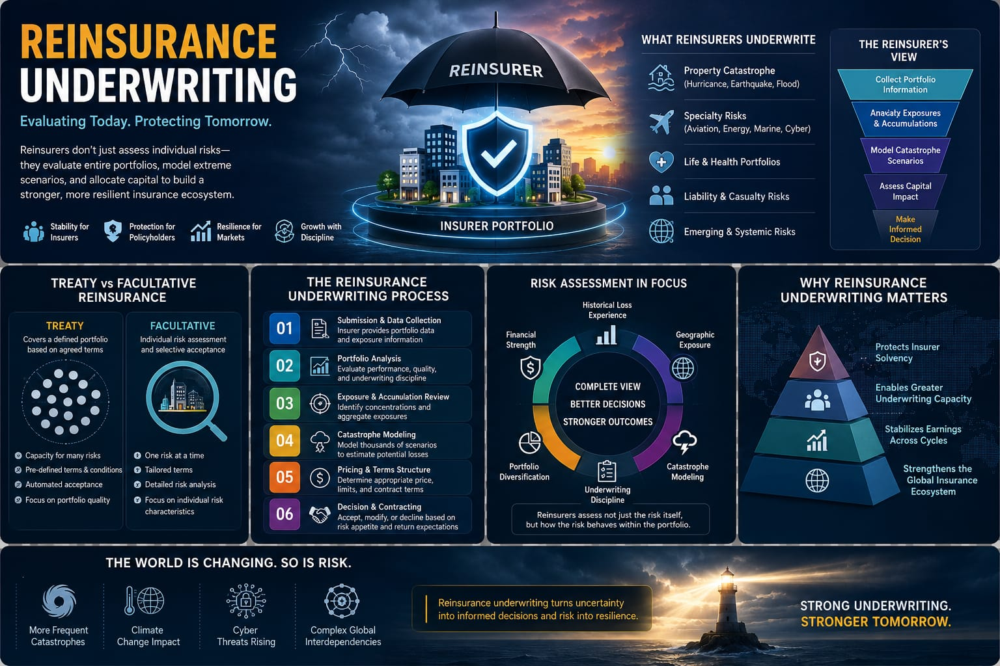
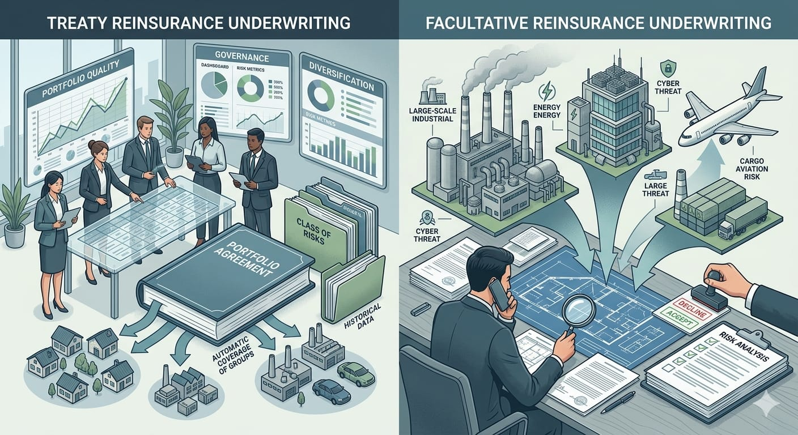

# Reinsurance Underwriting: How Reinsurers Evaluate Risk, Allocate Capital, and Protect Global Insurance Markets

---

## Contributors:
1. [Nilesh Saraf](https://github.com/nileshsaraf56), [LinkedIn](https://www.linkedin.com/in/nilesh-saraf-8b7aa327b/)
2. [Shishupal Kumar](https://github.com/shishupalamigo), [LinkedIn](https://www.linkedin.com/in/shishupalamigo/)
3. [Nikhil KG](https://github.com/nikhilkg18), [LinkedIn](https://www.linkedin.com/in/nikhil-k-g)
4. [Shouvik Karfa](https://github.com/ShouvikKarfa), [LinkedIn](https://www.linkedin.com/in/shouvikkarfa/)

---

## Summary & Key Points

Reinsurance underwriting is the specialized discipline through which reinsurers evaluate, price, and manage risks transferred from insurance companies. Unlike primary underwriting, which focuses on individual policyholders or assets, reinsurance underwriting assesses entire portfolios, catastrophe exposures, capital requirements, and systemic risk accumulations.

Modern reinsurers combine catastrophe modeling, portfolio analytics, exposure management, and capital allocation frameworks to determine whether the expected return adequately compensates for the risks being assumed. As climate change, cyber threats, and global economic uncertainties continue to reshape risk landscapes, reinsurance underwriting has become a critical function supporting insurer solvency, market stability, and long-term resilience across the global insurance ecosystem.

---



*Figure 1: Reinsurance underwriting evaluates portfolio-level risks, catastrophe exposures, capital allocation requirements, and long-term profitability across global insurance markets.*

---

## Introduction

In traditional insurance underwriting, the focus is typically on evaluating an individual risk. A life insurer assesses the health profile of a policyholder, a property insurer evaluates the exposure of a building, and a motor insurer analyzes driving history before issuing coverage.

Reinsurance underwriting operates at a completely different level.

Rather than underwriting individual policyholders, reinsurers evaluate the risks assumed by insurance companies themselves. Their responsibility is not merely to determine whether a single risk is acceptable, but to assess the quality, composition, and long-term performance of entire insurance portfolios.

This requires evaluating catastrophe exposures, geographic concentrations, capital adequacy, portfolio diversification, claims volatility, underwriting discipline, and emerging systemic risks. Decisions often involve billions of dollars of exposure spread across multiple countries, industries, and lines of business.

As climate-related catastrophes, cyber threats, and economic uncertainties continue to reshape global risk landscapes, reinsurance underwriting has become one of the most strategically important disciplines within the insurance industry.

This article explores how reinsurance underwriting works, the methodologies used by reinsurers, the decision-making frameworks that guide risk acceptance, and the challenges shaping the future of the reinsurance market.

---

## Why Reinsurance Matters

Modern economies depend on insurers' ability to absorb risk. However, catastrophic events such as hurricanes, earthquakes, pandemics, and cyber incidents can generate losses far beyond the capacity of a single insurer.

Reinsurance serves as a financial shock absorber for the insurance industry. By distributing risk across multiple organizations and geographies, it helps insurers remain solvent, continue serving policyholders, and maintain confidence in financial markets during periods of significant loss activity.

Without reinsurance, many large-scale infrastructure projects, commercial enterprises, and catastrophe-prone regions would be substantially more difficult or expensive to insure.

---

## Understanding the Role of Reinsurance Underwriting

At its core, reinsurance exists to transfer risk from insurers to reinsurers.

Insurance companies use reinsurance to:

- Protect capital
- Reduce earnings volatility
- Increase underwriting capacity
- Manage catastrophic exposures
- Maintain regulatory solvency requirements

Before accepting transferred risks, reinsurers must conduct their own underwriting assessment. Every transaction requires them to answer a fundamental question:

**Does the expected return adequately compensate for the portfolio risk being assumed?**

Unlike primary insurers, reinsurers evaluate risk at an aggregated level. Their underwriting decisions influence not only profitability but also financial stability across entire insurance markets.

In this sense, reinsurance underwriting functions as a second layer of risk governance within the global insurance ecosystem

---

## The Evolution of Reinsurance Underwriting

Historically, reinsurance underwriting relied heavily on relationships, experience, and professional judgment.

Underwriters assessed submissions using historical loss records, market knowledge, and personal expertise.

While these elements remain important, modern reinsurance underwriting has evolved significantly.

Today, reinsurers employ:

- Catastrophe models
- Exposure management platforms
- Predictive analytics
- Portfolio simulation techniques
- Capital modeling frameworks
- Machine learning-assisted risk analysis

The shift from intuition-driven decision-making to data-driven portfolio analysis has transformed underwriting into a highly quantitative discipline.

---

## The Reinsurance Underwriting Lifecycle

```text
Portfolio Submission
        │
        ▼
┌─────────────────────┐
│ Exposure Data Review│
└──────────┬──────────┘
           │
           ▼
┌─────────────────────┐
│ Portfolio Analysis  │
│ • Loss History      │
│ • Diversification   │
│ • Concentrations    │
└──────────┬──────────┘
           │
           ▼
┌─────────────────────┐
│ Catastrophe Modeling│
│ • Hurricane         │
│ • Earthquake        │
│ • Flood             │
│ • Wildfire          │
└──────────┬──────────┘
           │
           ▼
┌─────────────────────┐
│ Capital Assessment  │
│ & Pricing Analysis  │
└──────────┬──────────┘
           │
           ▼
     UNDERWRITING
       DECISION

 Approve │ Modify │ Decline
```

### Portfolio Submission and Data Collection

The process typically begins when a ceding insurer submits information regarding the portfolio it intends to reinsure.

Common information includes:

- Historical loss experience
- Premium volumes
- Geographic distribution
- Exposure concentrations
- Catastrophe accumulations
- Claims development patterns
- Underwriting guidelines

The quality of data submitted often determines the effectiveness of subsequent underwriting decisions.

---

## Treaty and Facultative Reinsurance Underwriting



*Figure 2: Comparison between treaty and facultative underwriting approaches in reinsurance.*

### Treaty Reinsurance Underwriting

Treaty reinsurance involves an agreement covering an entire class or portfolio of risks. Under a treaty arrangement, the reinsurer agrees to assume risks that fall within predefined parameters without individually underwriting every policy.

As a result, treaty underwriting focuses heavily on portfolio quality, underwriting governance, historical performance, risk diversification, and capital adequacy. Success depends on understanding the insurer's overall underwriting practices rather than reviewing individual policies.

Treaty underwriters typically analyze:

- Historical loss performance
- Portfolio composition
- Exposure concentrations
- Catastrophe accumulations
- Pricing adequacy
- Underwriting governance

Because treaty agreements often cover thousands or even millions of policies, the emphasis is on portfolio behavior rather than individual risk characteristics.

### Facultative Reinsurance Underwriting

Facultative reinsurance operates differently. Each risk is evaluated individually, and the reinsurer retains the discretion to accept or decline specific submissions.

Facultative placements are commonly used for:

- Large commercial properties
- Energy and infrastructure projects
- Aviation and marine risks
- Specialized industrial facilities
- Risks exceeding treaty limits

Because each exposure receives separate underwriting attention, facultative underwriting often requires deeper technical analysis than treaty underwriting. Underwriters assess construction details, engineering reports, operational risks, loss prevention measures, and scenario-based loss estimates before reaching a decision.

While treaty underwriting emphasizes portfolio-level performance, facultative underwriting focuses on the unique characteristics of a specific risk and its potential loss severity.

---

## Risk Assessment Frameworks in Reinsurance

Modern reinsurance underwriting relies on multiple layers of risk assessment.

Expected loss analysis represents the foundation of pricing decisions. However, expected loss alone provides an incomplete picture of risk.

For this reason, reinsurers devote significant attention to tail-risk assessment. Many of the industry's largest losses arise from low-frequency but high-severity events.

Reinsurers also increasingly assess opportunities through a capital-based framework, evaluating capital requirements, return on capital, and enterprise risk concentrations.

---

## Decision-Making in Reinsurance Underwriting

Contrary to popular belief, underwriting decisions are rarely simple accept-or-decline choices.

Instead, underwriters evaluate:

- Risk Acceptability
- Pricing Adequacy
- Portfolio Diversification Impact
- Capital Efficiency
- Strategic Alignment

```text
                    REINSURANCE DECISION FRAMEWORK

                         Expected Return
                                ▲
                                │
                                │
      Reject                    │                    Accept
      Risk                      │                  Opportunity
                                │
────────────────────────────────┼────────────────────────────►
                                │
                                │
                                │
                                ▼
                         Portfolio Risk

              Low Return + High Risk = Decline

              High Return + Controlled Risk = Accept

              High Return + High Risk = Reprice / Restructure
```

---

## Emerging Challenges in Reinsurance Underwriting

- Climate Change and Catastrophe Volatility
- Cyber Risk Accumulation
- Data Quality and Model Uncertainty
- Capital Constraints
- Regulatory and ESG Expectations

These factors continue to increase the complexity of underwriting decisions and require continuous adaptation of models, processes, and governance frameworks.

---

## The Future of Reinsurance Underwriting


*Figure 3: AI-assisted underwriting, climate-aware risk models, dynamic pricing, and continuous monitoring are shaping the future of reinsurance underwriting.*

```text
Traditional UW
      │
      ▼
Historical Data
      │
      ▼
Periodic Assessment
      │
      ▼
Manual Decisions

═══════════════════════════════

Future UW
      │
      ▼
Real-Time Data Streams
      │
      ▼
AI-Assisted Analytics
      │
      ▼
Continuous Risk Monitoring
      │
      ▼
Dynamic Pricing & Capital Allocation
```

The next generation of reinsurance underwriting will likely be defined by deeper integration of analytics, artificial intelligence, and real-time risk monitoring.

Several trends are already emerging:

- AI-assisted underwriting support
- Real-time exposure management
- Dynamic pricing models
- Climate-adjusted catastrophe modeling
- Advanced portfolio optimization
- Capital-aware decision engines

Despite these technological advancements, human judgment will remain essential.

---

## Conclusion

Reinsurance underwriting occupies a unique position within the global insurance ecosystem. Unlike primary underwriting, which focuses on individual risks, reinsurance underwriting evaluates entire portfolios, catastrophe exposures, capital requirements, and systemic uncertainties.

Its purpose extends beyond risk transfer. It serves as a mechanism for maintaining market stability, protecting insurer solvency, and enabling the insurance industry to absorb increasingly complex risks.

As emerging threats reshape the global risk landscape, the importance of disciplined, data-driven, and strategically aligned reinsurance underwriting will only continue to grow.

Organizations that master this discipline will play a critical role in strengthening resilience across the global financial and insurance systems.

---

## References

1. **Investopedia – Reinsurance Business Model**  
   https://www.investopedia.com/articles/insurance/082916/business-model-reinsurance-companies.asp

2. **Guy Carpenter – Facultative or Treaty Reinsurance**  
   https://www.guycarp.com/insights/2019/04/facultative-or-treaty-and-why-the-need-for-hybrid-solutions-part-i.html

3. **Captives Insure – Treaty and Facultative Reinsurance: Key Components to Consider**  
   https://captives.insure/insights/treaty-and-facultative-reinsurance-key-components-to-consider-for-your-captive-program

4. **Insurance Business Asia – Difference Between Treaty and Facultative Reinsurance**  
   https://www.insurancebusinessmag.com/asia/guides/whats-the-difference-between-treaty-and-facultative-reinsurance-168932.aspx

5. **IRMI – Underwriting and Claims Clauses in Reinsurance Agreements**  
   https://www.irmi.com/articles/expert-commentary/underwriting-and-claims-clauses-in-reinsurance-agreements

6. **Swiss Re Institute – Research and Publications**  
   https://www.swissre.com/institute.html

7. **Munich Re – Insights and Research**  
   https://www.munichre.com/en/insights.html
