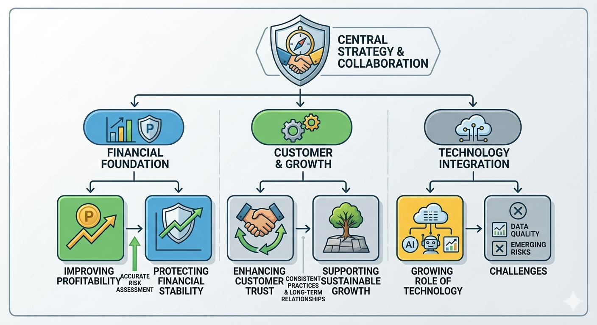

# Underwriting Uncovered: Risk, Decisions, and Business Impact

---
## Contributors:
1. [Nilesh Saraf](https://github.com/nileshsaraf56), [LinkedIn](https://www.linkedin.com/in/nilesh-saraf-8b7aa327b/)
2. [Shishupal Kumar](https://github.com/shishupalamigo), [LinkedIn](https://www.linkedin.com/in/shishupalamigo/)
3. [Nikhil KG](https://github.com/nikhilkg18), [LinkedIn](https://www.linkedin.com/in/nikhil-k-g)
4. [Shouvik Karfa](https://github.com/ShouvikKarfa), [LinkedIn](https://www.linkedin.com/in/shouvikkarfa/)

---


## Summary & Key Points
Underwriting is the foundational financial process used to identify, evaluate, and responsibly manage risk before a transaction such as a loan, insurance policy, or investment is finalized. By gathering and analyzing historical, financial, and behavioral data, institutions place applicants into risk categories to determine approval terms or premium costs. Modern underwriting increasingly integrates technologies like AI, machine learning, and predictive analytics to balance processing speed with accuracy. Ultimately, effective underwriting safeguards an organization’s financial stability, enhances customer trust, and drives sustainable business growth.

---

## Introduction
Every financial transaction involves a degree of uncertainty A lender cannot know with complete certainty whether a borrower will repay a loan An insurance company cannot predict exactly when a policyholder will file a claim Similarly, investors cannot guarantee the future performance of a company they choose to support Yet these decisions are made every day, often involving significant amounts of money 

The process that enables organizations to make such decisions with confidence is known as **underwriting** Although underwriting often operates behind the scenes, it plays a critical role in the financial ecosystem It helps institutions evaluate risk, make informed decisions, and maintain financial stability while continuing to grow their business In simple terms, underwriting is about answering one fundamental question: *Is the risk worth taking?*

---

## Understanding Risk in Underwriting
Risk lies at the heart of every underwriting decision. Whenever an organization provides a loan, issues an insurance policy, or supports a financial investment, there is always the possibility of a future loss. The purpose of underwriting is to identify, evaluate, and manage that uncertainty before a commitment is made. 

### Industry-Specific Risks
Different industries face distinct types of financial risk:
* **Banks:** Face the risk of borrowers failing to repay loans.
* **Insurance Companies:** Face the risk of claims exceeding expectations.
* **Investment Firms:** Face market and valuation risks.
* **Businesses:** Face operational and financial risks when extending credit or entering partnerships.

To assess these risks, underwriters analyze a variety of factors, including financial history, income levels, existing obligations, asset ownership, industry trends, and historical performance patterns. The goal is not to eliminate risk entirely; taking calculated risks is essential for business growth. Instead, underwriting helps organizations understand the level of risk involved and decide whether it falls within acceptable limits.

```
                     ┌─────────────────────────────┐
                     │   Gather Applicant Data     │
                     │  (Financials, History, Etc.)│
                     └──────────────┬──────────────┘
                                    │
                                    ▼
                     ┌─────────────────────────────┐
                     │    Evaluate & Model Risk    │
                     │   (Assess Loss Likelihood)  │
                     └──────────────┬──────────────┘
                                    │
                                    ▼
                     ┌─────────────────────────────┐
                     │   Determine Acceptability   │
                     │   Within Business Limits    │
                     └─────────────────────────────┘
```

---

## How Underwriting Decisions Are Made
While underwriting processes vary across industries, the underlying approach remains similar. The first step is gathering relevant information, such as financial records, credit reports, business performance data, medical history, or other supporting documents. Once the information is collected, it is analyzed to determine the likelihood and potential impact of future losses. Based on this assessment, applicants are generally placed into risk categories. Lower-risk applicants typically receive more favorable terms, while higher-risk applicants may face additional conditions, higher costs, or rejection.

### The Three Categories of Underwriting Decisions
Most underwriting decisions fall into one of three outcomes:

1. **Approval:** The risk level is considered acceptable, and the application is approved under standard terms.
2. **Conditional Approval:** The application is approved, but additional safeguards are introduced. Examples include higher insurance premiums, additional collateral, lower credit limits, or stricter contractual conditions.
3. **Rejection:** The risk exceeds the organization's tolerance level, making the transaction financially impractical or potentially harmful.

Contrary to popular belief, underwriting is not simply about finding reasons to reject applications. Its primary purpose is to find ways to responsibly manage risk while enabling business opportunities wherever possible.

```
                     ┌──────────────────────────────┐
                     │   Information Gathering      │
                     │ (Financials, Credit, Medical)│
                     └──────────────┬───────────────┘
                                    │
                                    ▼
                     ┌──────────────────────────────┐
                     │  Risk Analysis & Categorization│
                     └──────────────┬───────────────┘
                                    │
            ┌───────────────────────┼───────────────────────┐
            │                       │                       │
            ▼                       ▼                       ▼
   ┌─────────────────┐     ┌─────────────────┐     ┌─────────────────┐
   │    Approval     │     │   Conditional   │     │    Rejection    │
   │ (Standard Terms)│     │    Approval     │     │ (Risk Exceeds   │
   └─────────────────┘     │(Safeguards/Fees)│     │   Tolerance)    │
                           └─────────────────┘     └─────────────────┘
```

---

## Types of Underwriting
Although the core principles remain consistent, underwriting serves different purposes across major sectors:

### 1. Loan Underwriting
Commonly used by banks and lending institutions. Before approving a loan, lenders evaluate factors such as income stability, employment history, credit scores, existing debt obligations, and repayment capacity. For example, when an individual applies for a home loan, the lender assesses whether the applicant can comfortably manage monthly payments over the life of the loan. The objective is to reduce the likelihood of default while extending credit to qualified borrowers.

### 2. Insurance Underwriting
Insurance underwriting focuses on estimating the probability of future claims. Insurers evaluate factors that may influence risk, including age, health conditions, driving records, lifestyle habits, property characteristics, and geographic location. Based on the assessed risk level, insurers determine coverage terms and premium amounts, ensuring that premiums accurately reflect the risks being insured.

### 3. Securities Underwriting
Securities underwriting occurs when companies raise capital through stocks or bonds. Investment banks evaluate a company's financial health, growth potential, industry position, and market conditions before helping bring securities to market. Their role helps companies access funding while providing investors with greater confidence in the offering.

---

## The Growing Role of Technology
Technology has transformed underwriting significantly over the past decade. Traditionally, underwriting relied heavily on manual reviews and professional judgment. While human expertise remains critical, modern underwriting increasingly leverages technology to improve efficiency and accuracy.

Modern underwriting systems frequently incorporate:
* Credit scoring models
* Artificial intelligence (AI) and Machine learning algorithms
* Predictive analytics
* Automated document verification
* Real-time financial data

These tools enable organizations to process applications more quickly while maintaining consistent evaluation standards. For customers, this means faster approvals and a smoother experience. For businesses, it results in improved efficiency, reduced operational costs, and better overall risk management. However, technology does not replace human judgment entirely; complex cases, regulatory requirements, and unique circumstances still require experienced underwriters to make final, informed decisions.

---

## Strategic Framework & Business Impact
Underwriting is often viewed strictly as a risk-management function, but its strategic influence extends across the entire enterprise. 

Below is the strategic mapping of underwriting functions, showing how technology integration, operational frameworks, and risk foundations drive growth and stability:



### Protecting Financial Stability
One of the primary objectives of underwriting is protecting organizations from avoidable losses. Poor underwriting decisions can result in loan defaults, excessive insurance claims, or unsuccessful investments. Strong underwriting helps maintain financial stability by ensuring risks are properly evaluated before commitments are made.

### Improving Profitability
Accurate risk assessment allows organizations to price products appropriately. When risks are underestimated, businesses may suffer losses; when risks are overestimated, products may become uncompetitive. Effective underwriting strikes the right balance, improving both profitability and competitiveness.

### Enhancing Customer Trust
Customers expect fair and transparent decisions. Organizations with consistent underwriting practices are often better positioned to build trust and maintain long-term customer relationships.

### Supporting Sustainable Growth
Growth without proper risk management can expose organizations to significant financial challenges. Underwriting helps businesses expand responsibly by ensuring growth opportunities align with their risk appetite and strategic objectives.

---

## Challenges in Modern Underwriting
As markets evolve, underwriting functions face a dynamic landscape of new challenges:

* **Data Quality:** Underwriting decisions are only as reliable as the data supporting them. Inaccurate or incomplete information can lead to poor risk assessments and costly mistakes.
* **Emerging Risks:** New threats continue to emerge, including cyber risks, climate-related events, and rapidly changing economic conditions. Many of these are difficult to predict using traditional models alone.
* **Balancing Speed and Accuracy:** Modern customers expect quick decisions . At the same time, organizations cannot afford to compromise the quality of risk assessments . Finding the right balance remains an industry-wide challenge .
* **Regulatory Expectations:** Financial institutions operate within highly regulated environments. Underwriters must ensure that decisions comply with legal, ethical, and industry standards while maintaining business objectives.

---

## Conclusion
Underwriting is far more than a routine approval process. It is a structured approach to understanding risk, making informed decisions, and supporting sustainable business growth. Whether in banking, insurance, or capital markets, underwriting helps organizations navigate uncertainty with greater confidence . It protects financial stability, improves profitability, enhances customer trust, and enables responsible expansion. 

As technology continues to reshape financial services and new risks emerge, underwriting will remain one of the most important functions in modern business—quietly influencing decisions that affect organizations, customers, and entire industries every day.
